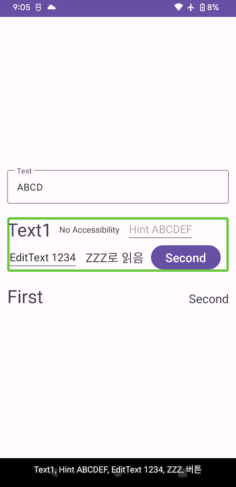

## Sample

```xml
<androidx.constraintlayout.widget.ConstraintLayout
   ...>

   <TextView
      android:id="@+id/textView1"
      android:text="Text1" />

   <TextView
      android:id="@+id/textView2"
      android:importantForAccessibility="no"
      android:text="No Accessibility" />

   <EditText
      android:id="@+id/editView"
      android:hint="Hint ABCDEF" />

   <EditText
      android:id="@+id/editView2"
      android:hint="QWERTY"
      android:text="EditText 1234" />

   <TextView
      android:id="@+id/textView3"
      android:contentDescription="ZZZ"
      android:text="ZZZ로 읽음" />

   <Button
      android:id="@+id/button"
      android:text="Second" />

   <com.pluu.constraintlayouthelper.ConstraintLayoutAccessibilityHelper
      ...
      app:constraint_referenced_ids="textView1,editView,editView2,textView3" />

</androidx.constraintlayout.widget.ConstraintLayout>
```

```kotlin
ViewCompat.setAccessibilityDelegate(
   binding.textView3,
   object : AccessibilityDelegateCompat() {
      override fun onInitializeAccessibilityNodeInfo(
         host: View,
         info: AccessibilityNodeInfoCompat
      ) {
         super.onInitializeAccessibilityNodeInfo(host, info)
         info.roleDescription = "버튼"
      }
   }
)
```

## Result

|                Sample                |
| :----------------------------------: |
|  |

